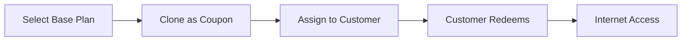

## Overview

Coupons are customized copies of internet plans that can be assigned to specific customers. They're useful for:
- Promotional offers
- Special pricing for specific customers
- Custom validity periods
- VIP customer packages

## How Coupons Work



## Coupon List

The Coupons page displays:

| Column | Description |
|--------|-------------|
| # | Row number |
| Customer | Assigned customer account |
| Code | Unique coupon code |
| Plan | Base plan name |
| Validity | Custom validity period |
| Price | Custom price |
| Created At | When coupon was created |

## Creating a Coupon

<Steps>
  <Step title="Click Clone Plan">
    Click the **Clone Plan** button at the top
  </Step>
  <Step title="Select Base Plan">
    Choose an internet plan to clone from
  </Step>
  <Step title="Customize Settings">
    Modify any fields (price, validity, etc.)
  </Step>
  <Step title="Assign to Customer">
    Select the customer who will receive the coupon
  </Step>
  <Step title="Create">
    Click **Submit** to create the coupon
  </Step>
</Steps>

<Frame>
  
</Frame>

## Coupon vs Voucher

| Aspect | Coupon | Voucher |
|--------|--------|---------|
| Creation | Cloned from plan | Created on purchase |
| Assignment | Pre-assigned to customer | Assigned on payment |
| Customization | Can modify plan settings | Uses original plan |
| Redemption | Customer activates manually | Auto-activated |
| Re-usable | Configurable | Single use |

## Customizable Fields

When cloning a plan to create a coupon:

| Field | Description | Can Modify? |
|-------|-------------|-------------|
| Name | Coupon display name | ✅ Yes |
| Price | Custom pricing | ✅ Yes |
| Validity | Duration | ✅ Yes |
| Data Limit | Data bundle | ✅ Yes |
| Speed | Rate limit | ✅ Yes |
| Re-uses | How many times redeemable | ✅ Yes |

## Editing a Coupon

<Steps>
  <Step title="Click Edit Icon">
    Click the edit (pencil) icon on the coupon row
  </Step>
  <Step title="Update Fields">
    Modify the desired settings
  </Step>
  <Step title="Save">
    Click **Submit** to update
  </Step>
</Steps>

## Deleting a Coupon

<Steps>
  <Step title="Click Delete Icon">
    Click the delete (trash) icon
  </Step>
  <Step title="Confirm">
    Click **Delete** to remove the coupon
  </Step>
</Steps>

<Note>
  Deleting an unused coupon is safe. If the coupon has been redeemed, the resulting voucher remains active.
</Note>

## Viewing Coupon Details

Click the info icon to see:
- Full coupon code
- Assigned customer
- All coupon settings
- Redemption status
- Creation date

## Searching Coupons

Search by:
- Customer Account Number
- Coupon Code
- Plan Name

```
Example: "promo" → All coupons with "promo" in name
```

## Use Cases

<AccordionGroup>
  <Accordion icon="gift" title="Promotional Offers">
    Create discounted coupons for special events or holidays
  </Accordion>
  <Accordion icon="star" title="VIP Customers">
    Offer exclusive plans to high-value customers
  </Accordion>
  <Accordion icon="clock" title="Extended Validity">
    Give loyal customers extra access time
  </Accordion>
  <Accordion icon="percent" title="Trial Periods">
    Offer free or discounted trials to new customers
  </Accordion>
</AccordionGroup>

## Coupon Redemption

When using a coupon:

1. **Via Voucher Assignment**: Admin checks "Use Coupon" when assigning
2. **Via Captive Portal**: Customer enters coupon code (if enabled)

## Best Practices

<CardGroup cols={2}>
  <Card title="Track Usage" icon="chart-bar">
    Monitor which coupons are popular
  </Card>
  <Card title="Set Limits" icon="lock">
    Use re-use limits to prevent abuse
  </Card>
  <Card title="Clear Naming" icon="tag">
    Name coupons descriptively (e.g., "BLACK-FRIDAY-50OFF")
  </Card>
  <Card title="Expiry Dates" icon="calendar">
    Set coupon expiry to create urgency
  </Card>
</CardGroup>

## Troubleshooting

| Issue | Possible Cause | Solution |
|-------|----------------|----------|
| Can't create coupon | No base plans exist | Create a plan first |
| Coupon won't redeem | Already used max times | Check re-use limit |
| Wrong customer | Assigned incorrectly | Edit or delete and recreate |

## Next Steps

<CardGroup cols={2}>
  <Card
    title="Assign Vouchers"
    icon="ticket"
    href="/billing/vouchers"
  >
    Use coupons when assigning vouchers
  </Card>
  <Card
    title="View Payments"
    icon="money-bill"
    href="/payments/overview"
  >
    Track coupon-related transactions
  </Card>
</CardGroup>

