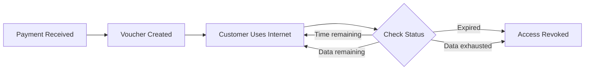

## Overview

Vouchers are time or data-limited access tokens that grant customers internet access. Each voucher is linked to a specific customer and internet plan.

## Understanding Vouchers

<CardGroup cols={2}>
  <Card title="What is a Voucher?" icon="ticket">
    A voucher grants internet access for a specific duration or data amount
  </Card>
  <Card title="How It Works" icon="gear">
    Customer pays → Voucher assigned → Internet access until expiry
  </Card>
</CardGroup>

## Voucher List

The Vouchers page displays all active vouchers:

| Column | Description |
|--------|-------------|
| # | Row number |
| Percent Used | Visual progress bar showing usage |
| Customer | Account number |
| Phone Number | Customer's phone |
| Code | Unique voucher code |
| Plan | Internet plan name |
| Purchase Date | When voucher was assigned |
| Expiry Date | When voucher expires |

<Frame>
  
</Frame>

## Percent Used Indicator

The progress bar shows voucher time usage:

```
0% ━━━━━━━━━━ 100%
   │         │
   │         └─ Expired/Fully used
   └─ Just started

Color: Progresses from green to yellow to red
```

## Assigning a Voucher

<Steps>
  <Step title="Click Assign Voucher">
    Click the **Assign Voucher** button at the top
  </Step>
  <Step title="Select Customer">
    Choose a customer from the dropdown
  </Step>
  <Step title="Select Plan">
    Choose an internet plan
  </Step>
  <Step title="Optional: Use Coupon">
    Check "Use Coupon" to apply an existing coupon instead
  </Step>
  <Step title="Confirm">
    Click **Assign** to create the voucher
  </Step>
</Steps>

### Balance Check

<Warning>
  The customer must have sufficient account balance to purchase the plan. If balance is insufficient, you'll see an error message.
</Warning>

```
Error: "Insufficient balance to assign this plan. 
        Available balance: 50, required: 100"
```

## Viewing Voucher Details

Click the info icon on any voucher row to see:
- Full voucher code
- Customer details
- Plan information
- Start and end times
- Usage statistics

## Deleting a Voucher

<Warning>
  Deleting a voucher immediately revokes the customer's internet access.
</Warning>

<Steps>
  <Step title="Click Delete Icon">
    Click the delete (trash) icon on the voucher row
  </Step>
  <Step title="Confirm Deletion">
    Click **Delete** in the confirmation dialog
  </Step>
</Steps>

## Searching Vouchers

Search by:
- Customer Account Number
- Voucher Code
- Plan Name
- Phone Number

```
Example: "254" → All customers with 254 in phone
Example: "daily" → All vouchers for plans containing "daily"
```

## Voucher Lifecycle



## How Customers Get Vouchers

<AccordionGroup>
  <Accordion icon="mobile" title="Through Captive Portal">
    Customer pays via M-PESA STK push, voucher auto-assigned
  </Accordion>
  <Accordion icon="user" title="Manual Assignment">
    Admin assigns voucher after receiving payment
  </Accordion>
  <Accordion icon="tag" title="Using Coupon">
    Customer redeems a pre-assigned coupon
  </Accordion>
  <Accordion icon="wallet" title="Kopa (BNPL)">
    Customer gets voucher now, pays later
  </Accordion>
</AccordionGroup>

## Auto-Expiry

Vouchers automatically expire based on:

| Type | Expiry Trigger |
|------|----------------|
| Time-based | When validity period ends |
| Data-based | When data limit is reached |
| Combined | Whichever comes first |

## Voucher Codes

Each voucher has a unique code:

```
Format: ABC-1234-XYZ
Length: Typically 8-12 characters
Used for: Customer reference, support lookup
```

## Best Practices

<AccordionGroup>
  <Accordion icon="chart-line" title="Monitor Active Vouchers">
    Regularly check for vouchers near expiry
  </Accordion>
  <Accordion icon="clock" title="Time Zones">
    All times are in your server's timezone
  </Accordion>
  <Accordion icon="bell" title="Expiry Notifications">
    Configure SMS reminders for expiring vouchers
  </Accordion>
</AccordionGroup>

## Troubleshooting

| Issue | Possible Cause | Solution |
|-------|----------------|----------|
| Customer can't connect | Voucher expired | Assign new voucher |
| Voucher shows but no access | RADIUS sync issue | Check RADIUS connection |
| Duplicate vouchers | Same plan assigned twice | Delete duplicate |
| Wrong expiry time | Time zone mismatch | Verify server timezone |

## Next Steps

<CardGroup cols={2}>
  <Card
    title="Create Coupons"
    icon="tag"
    href="/billing/coupons"
  >
    Clone plans for specific customers
  </Card>
  <Card
    title="View Payments"
    icon="money-bill"
    href="/payments/overview"
  >
    Check payment transactions
  </Card>
</CardGroup>

