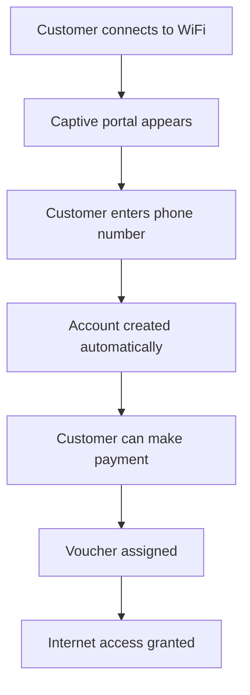

## Overview

Hotspot customers are users who connect to your WiFi network through a captive portal. They're identified primarily by their phone number and device MAC address.

## Customer List

The Hotspot Customers page displays a data grid with:

| Column | Description |
|--------|-------------|
| # | Row number |
| Account No | Unique customer identifier |
| Expenditure | Total amount customer has spent |
| Account Balance | Current prepaid balance |
| Phone | Customer's mobile number |
| MAC Address | Device hardware address |
| Joined | Registration date/time |

<Frame>
  
</Frame>

## Adding a Customer

<Steps>
  <Step title="Click Add Customer">
    Click the **Add Customer** button at the top of the page
  </Step>
  <Step title="Enter Phone Number">
    Enter the customer's phone number (must be valid for SMS)
  </Step>
  <Step title="Save">
    Click **Submit** to create the customer account
  </Step>
</Steps>

<Note>
  Customers can also self-register through the captive portal when they first connect to your hotspot.
</Note>

## Viewing Customer Details

Click on any customer row to open the details dialog showing:

- Account Number
- Phone Number
- MAC Address(es)
- Account Balance
- Total Expenditure
- Registration Date
- Active Vouchers (if any)

## Editing a Customer

<Steps>
  <Step title="Click Edit Icon">
    Click the edit (pencil) icon on the customer row
  </Step>
  <Step title="Update Details">
    Modify the phone number or other editable fields
  </Step>
  <Step title="Save Changes">
    Click **Submit** to save the updated information
  </Step>
</Steps>

## Deleting a Customer

<Warning>
  Deleting a customer is permanent and cannot be undone. Active vouchers will also be removed.
</Warning>

<Steps>
  <Step title="Click Delete Icon">
    Click the delete (trash) icon on the customer row
  </Step>
  <Step title="Confirm Deletion">
    Click **Delete** in the confirmation dialog
  </Step>
</Steps>

## Searching Customers

Use the search bar to find customers by:

```
Account Number: "ACC123456"
Phone Number: "254712345678"
MAC Address: "AA:BB:CC:DD:EE:FF"
```

<Tip>
  Partial matches work - searching "712" finds all phones containing those digits
</Tip>

## Customer Balance

### How Balance Works

```
Balance = Payments Received - Vouchers Purchased
```

| Action | Effect on Balance |
|--------|-------------------|
| Payment received | Balance increases |
| Voucher purchased | Balance decreases |
| Voucher expired | No change (already deducted) |

### Low Balance Alerts

If you've configured Balance Reminders in Settings, customers with low balance will receive automatic SMS notifications.

## Customer Actions

From the customer list, you can perform quick actions:

<CardGroup cols={3}>
  <Card title="View Details" icon="eye">
    See full customer information
  </Card>
  <Card title="Edit" icon="pen">
    Update customer details
  </Card>
  <Card title="Delete" icon="trash">
    Remove customer account
  </Card>
</CardGroup>

## Customer Registration Flow



## Troubleshooting

<AccordionGroup>
  <Accordion icon="phone" title="Duplicate Phone Number">
    Each phone number must be unique. If a customer has a duplicate, update one of the records.
  </Accordion>
  <Accordion icon="ethernet" title="Multiple MAC Addresses">
    Customers may have multiple devices. The system tracks all MAC addresses that have connected.
  </Accordion>
  <Accordion icon="wallet" title="Incorrect Balance">
    Check the Payments section to verify all transactions are properly associated.
  </Accordion>
</AccordionGroup>

## Integration with Other Features

| Feature | How It Relates |
|---------|---------------|
| Vouchers | Assigned to customers for internet access |
| Payments | Credited to customer balance |
| Notifications | Sent to customer phone number |
| Kopa | Customers can use BNPL for vouchers |

## Next Steps

<CardGroup cols={2}>
  <Card
    title="Assign Vouchers"
    icon="ticket"
    href="/billing/vouchers"
  >
    Give customers internet access
  </Card>
  <Card
    title="View Online Customers"
    icon="signal"
    href="/customers/online-customers"
  >
    See who's currently connected
  </Card>
</CardGroup>

