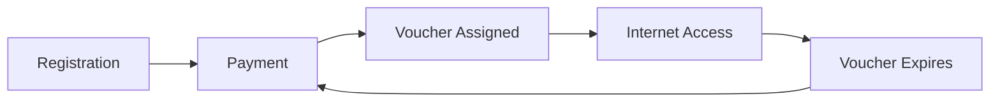

## Overview

The Customers section allows you to manage all your subscribers, whether they're using Hotspot or PPPoE services. You can:

- View all registered customers
- Add new customers manually
- Edit customer details
- Delete customer accounts
- Monitor online customers

## Customer Types

<CardGroup cols={2}>
  <Card title="Hotspot Customers" icon="wifi" href="/customers/hotspot-customers">
    Identified by phone number and MAC address, typically for WiFi access
  </Card>
  <Card title="PPPoE Customers" icon="router" href="/customers/pppoe-customers">
    Identified by username, for fixed-line internet connections
  </Card>
</CardGroup>

## Accessing Customers

<Steps>
  <Step title="Navigate to Customers">
    Click **Customers** in the left sidebar
  </Step>
  <Step title="Ensure Correct Mode">
    Use the toggle buttons to switch between Hotspot and PPPoE views
  </Step>
</Steps>

## Customer Data Fields

### Common Fields

| Field | Description |
|-------|-------------|
| Account No | Unique identifier for the customer |
| Phone | Customer's phone number |
| Joined | Registration date and time |

### Hotspot-Specific Fields

| Field | Description |
|-------|-------------|
| MAC Address | Device hardware address |
| Account Balance | Prepaid balance available |
| Expenditure | Total amount spent |

### PPPoE-Specific Fields

| Field | Description |
|-------|-------------|
| Username | PPPoE login username |
| Profile | Assigned internet plan |
| Status | Connection status |

## Customer Actions

<AccordionGroup>
  <Accordion icon="plus" title="Add Customer">
    Manually create a new customer account with required details
  </Accordion>
  <Accordion icon="eye" title="View Details">
    See complete customer information including balance and history
  </Accordion>
  <Accordion icon="pen" title="Edit Customer">
    Update customer phone number or other editable fields
  </Accordion>
  <Accordion icon="trash" title="Delete Customer">
    Remove a customer account (with confirmation)
  </Accordion>
</AccordionGroup>

## Search and Filter

The customer page includes a search bar to quickly find customers by:
- Account Number
- Phone Number
- MAC Address (Hotspot)
- Username (PPPoE)

<Tip>
  Use partial searches - entering "254" will find all customers with phone numbers containing "254"
</Tip>

## Customer Journey

## Online vs All Customers

| View | Description | Access |
|------|-------------|--------|
| All Customers | Complete customer database | Customers page |
| Online Customers | Currently connected sessions | Online Customers page |

## Best Practices

<CardGroup cols={2}>
  <Card title="Regular Cleanup" icon="broom">
    Periodically remove inactive accounts to keep your database clean
  </Card>
  <Card title="Accurate Data" icon="check">
    Ensure phone numbers are correct for SMS notifications
  </Card>
  <Card title="Balance Monitoring" icon="wallet">
    Monitor low-balance customers for targeted top-up reminders
  </Card>
  <Card title="MAC Tracking" icon="fingerprint">
    Use MAC addresses to identify returning customers
  </Card>
</CardGroup>

## Next Steps

<CardGroup cols={2}>
  <Card
    title="Hotspot Customers"
    icon="wifi"
    href="/customers/hotspot-customers"
  >
    Manage WiFi hotspot subscribers
  </Card>
  <Card
    title="PPPoE Customers"
    icon="router"
    href="/customers/pppoe-customers"
  >
    Manage fixed-line subscribers
  </Card>
</CardGroup>

