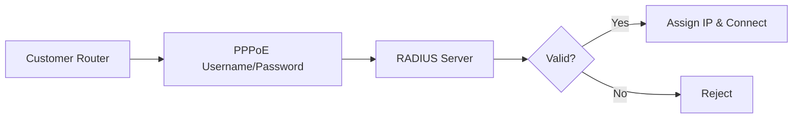

## Overview

PPPoE (Point-to-Point Protocol over Ethernet) customers are fixed-line subscribers who connect using username and password authentication, typically for home or business internet.

## Customer List

The PPPoE Customers page displays:

| Column | Description |
|--------|-------------|
| # | Row number |
| Account No | Unique identifier |
| Username | PPPoE login username |
| Phone | Customer contact number |
| Profile | Assigned internet plan |
| Joined | Registration date |

## Adding a PPPoE Customer

<Frame>
  
</Frame>
<Steps>
  <Step title="Click Add Customer">
    Click the **Add Customer** button
  </Step>
  <Step title="Enter Details">
    Fill in required fields:
    - Full Name
    - Phone Number
    - Username (for PPPoE login)
    - PPPoE Username
    - PPPoE Password
    - Other optional details
  </Step>
  <Step title="Assign default plan">
    Select an internet plan for the customer - A voucher with this plan will be autogenerated when a user pays for the plan.
  </Step>
  <Step title="Save">
    Click **Submit** to create the account
  </Step>
</Steps>

## PPPoE Authentication

When a customer connects via PPPoE:



## Customer Details

Click on a customer to view:
- Account information
- Assigned profile/plan
- Connection history
- Current session (if online)
- Account balance

## Managing Profiles

Each PPPoE customer has an assigned profile that defines:

| Setting | Description |
|---------|-------------|
| Download Speed | Maximum download rate |
| Upload Speed | Maximum upload rate |
| Data Limit | Monthly data cap (if any) |
| Validity | Subscription duration |

## Searching Customers

Search by:
- Account Number
- Username
- Phone Number

```
Example: Search "john" to find all usernames containing "john"
```

## Customer Actions

<CardGroup cols={3}>
  <Card title="View Details" icon="eye">
    Full customer information
  </Card>
  <Card title="Edit Profile" icon="pen">
    Change assigned plan
  </Card>
  <Card title="Disconnect" icon="plug">
    Force disconnect active session
  </Card>
</CardGroup>

## PPPoE vs Hotspot Customers

| Aspect | PPPoE | Hotspot |
|--------|-------|---------|
| Authentication | Username/Password | Phone/Voucher |
| Connection | Persistent | Session-based |
| Device | Router/Modem | Any WiFi device |
| Billing | Monthly subscription | Per-voucher |
| MAC Address | Not primary | Important identifier |

## Connection Status

Monitor customer connections:

| Status | Meaning |
|--------|---------|
| Online | Currently connected and authenticated |
| Offline | Not connected |
| Expired | Profile/subscription has ended |

## Troubleshooting

<AccordionGroup>
  <Accordion icon="triangle-exclamation" title="Customer Can't Connect">
    - Verify username and password are correct
    - Check if profile has expired
    - Ensure RADIUS server is reachable
    - Verify PPPoE server is running on Mikrotik
  </Accordion>
  <Accordion icon="gauge" title="Slow Speeds">
    - Check assigned profile speed limits
    - Verify there are no bandwidth queues
    - Check for network congestion
  </Accordion>
  <Accordion icon="plug-circle-xmark" title="Frequent Disconnections">
    - Check PPPoE keepalive settings
    - Verify customer router settings
    - Check for line quality issues
  </Accordion>
</AccordionGroup>

## Bulk Operations

For managing many customers:

1. Use the search/filter to find specific customers
2. Consider CSV import/export for bulk updates (contact support)
3. Use the API for automation

## Best Practices

<AccordionGroup>
  <Accordion icon="key" title="Strong Usernames">
    Use unique, memorable usernames (avoid simple ones like "user1")
  </Accordion>
  <Accordion icon="lock" title="Secure Passwords">
    Generate strong passwords or allow customers to set their own
  </Accordion>
  <Accordion icon="calendar" title="Timely Renewals">
    Send renewal reminders before subscription expires
  </Accordion>
</AccordionGroup>

## Next Steps

<CardGroup cols={2}>
  <Card
    title="Create PPPoE Plans"
    icon="wifi"
    href="/billing/plan-setup"
  >
    Set up internet profiles
  </Card>
  <Card
    title="View Online Customers"
    icon="signal"
    href="/customers/online-customers"
  >
    Monitor active connections
  </Card>
</CardGroup>

