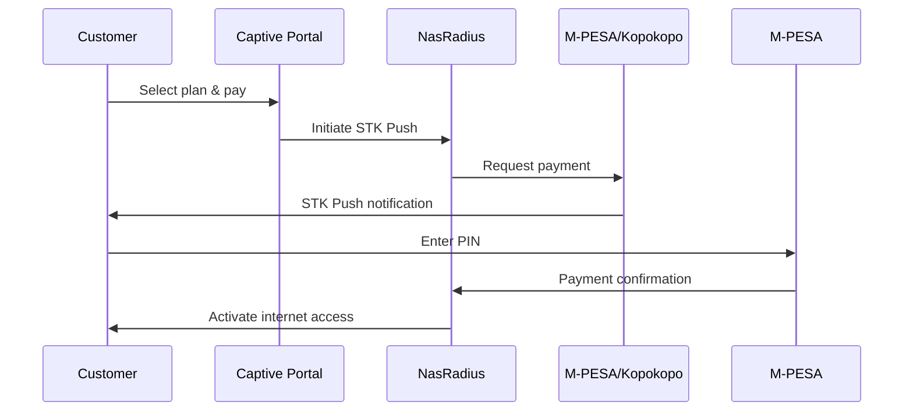

## Overview

NasRadius supports integrated mobile money payments through:
- **M-PESA** (Direct integration via Safaricom Daraja API)
- **Kopokopo** (Payment aggregator with STK Push)

<Note>
  Payment settings are only available in **Hotspot mode**. PPPoE mode uses a different payment workflow.
</Note>

## Accessing Payment Settings

<Steps>
  <Step title="Switch to Hotspot Mode">
    Ensure you're in Hotspot mode by clicking the **Hotspot** toggle button at the top of the page
  </Step>
  <Step title="Navigate to Settings">
    Click on **Settings** in the left sidebar
  </Step>
  <Step title="Select Payment Settings Tab">
    Click on the **Payment Settings** tab (5th tab)
  </Step>
</Steps>

## Configuring M-PESA

M-PESA integration requires credentials from the Safaricom Daraja portal.

### Prerequisites

Before configuring, you'll need:
- A Safaricom Daraja developer account
- An approved M-PESA Till or Paybill number
- API credentials (Consumer Key, Consumer Secret, Passkey)

### Configuration Steps

<Steps>
  <Step title="Click Configure/Edit">
    Click **Configure Payment Settings** (or **Edit Settings** if already configured)
  </Step>
  <Step title="Select M-PESA Provider">
    Choose **M-PESA** from the Payment Provider dropdown
  </Step>
  <Step title="Select Mode">
    Choose your payment mode:
    - **Till**: For Buy Goods payments
    - **Paybill**: For Paybill payments
  </Step>
  <Step title="Enter Credentials">
    Fill in the following fields:
    
    | Field | Description |
    |-------|-------------|
    | Consumer Key | From Daraja portal |
    | Consumer Secret | From Daraja portal |
    | Shortcode | Your M-PESA shortcode |
    | Till Number | Your Till number (if using Till mode) |
    | Passkey | Your Lipa na M-PESA passkey |
  </Step>
  <Step title="Save Configuration">
    Click **Create** (or **Update**) to save your settings
  </Step>
</Steps>

<Warning>
  Keep your API credentials secure. Never share them publicly.
</Warning>

## Configuring Kopokopo

<Link href="https://kopokopo.com" target="_blank">Kopokopo</Link> is a payment aggregator that simplifies M-PESA integration.

### Prerequisites

- A Kopokopo merchant account
- API credentials from Kopokopo dashboard

### Configuration Steps

<Steps>
  <Step title="Click Configure/Edit">
    Click **Configure Payment Settings**
  </Step>
  <Step title="Select Kopokopo Provider">
    Choose **Kopokopo** from the Payment Provider dropdown
  </Step>
  <Step title="Enter Credentials">
    Fill in the following fields:
    
    | Field | Description |
    |-------|-------------|
    | Client ID | From Kopokopo dashboard |
    | Client Secret | From Kopokopo dashboard |
    | STK Till Number | Your Kopokopo Till number |
  </Step>
  <Step title="Save Configuration">
    Click **Create** to save your settings
  </Step>
</Steps>

## Viewing Current Configuration

Once configured, the Payment Settings page displays your current configuration:

<Frame>
  
</Frame>

The display shows:
- Current provider (M-PESA or Kopokopo)
- Payment mode (Till/Paybill for M-PESA)
- Configured numbers (partially masked for security)

## How Payments Work

Once configured, customers can pay through the Captive Portal:

## Troubleshooting

<AccordionGroup>
  <Accordion icon="triangle-exclamation" title="STK Push Not Received">
    - Verify the customer's phone number is correct
    - Check that credentials are valid
    - Ensure the shortcode is active
  </Accordion>
  <Accordion icon="xmark" title="Payment Not Reflecting">
    - Check the Transactions page for payment status
    - Verify the callback URL is accessible
    - Contact support if the issue persists
  </Accordion>
  <Accordion icon="lock" title="Invalid Credentials Error">
    - Re-check your Consumer Key and Secret
    - Ensure you're using production (not sandbox) credentials
    - Verify the passkey matches your shortcode
  </Accordion>
</AccordionGroup>

## Next Steps

<CardGroup cols={2}>
  <Card
    title="Create Internet Plans"
    icon="wifi"
    href="/billing/plan-setup"
  >
    Set up your service packages
  </Card>
  <Card
    title="View Payments"
    icon="money-bill"
    href="/payments/overview"
  >
    Monitor incoming payments
  </Card>
</CardGroup>

