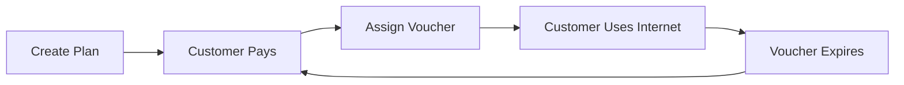
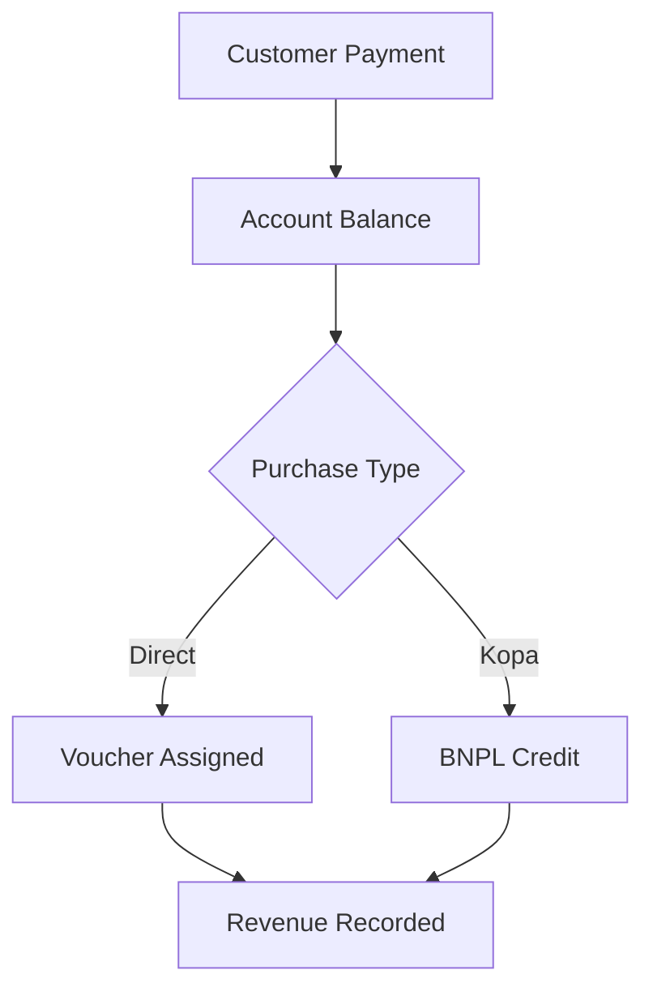

## Overview

NasRadius provides a comprehensive billing system that includes:
- **Internet Plans**: Define your service packages
- **Vouchers**: Grant customers time/data-limited access
- **Coupons**: Create customized plans for specific customers

## Billing Workflow

## Key Concepts

<CardGroup cols={3}>
  <Card title="Internet Plans" icon="wifi" href="/billing/plan-setup">
    Base service definitions with speeds, limits, and pricing
  </Card>
  <Card title="Vouchers" icon="ticket" href="/billing/vouchers">
    Time/data-limited access tokens assigned to customers
  </Card>
  <Card title="Coupons" icon="tag" href="/billing/coupons">
    Customized plans cloned from base plans for specific customers
  </Card>
</CardGroup>

## Plans vs Vouchers vs Coupons

| Feature | Plans | Vouchers | Coupons |
|---------|-------|----------|---------|
| Purpose | Define service packages | Grant access | Custom promotions |
| Created by | Admin | System (on purchase) | Admin (from plan) |
| Assigned to | N/A | Specific customer | Specific customer |
| Validity | N/A | Time-limited | Custom validity |
| Re-usable | Template | No (one-time) | Configurable |

## How Billing Works

### Hotspot Billing

1. **Customer makes payment** (M-PESA, manual, etc.)
2. **Balance credited** to customer account
3. **Customer purchases plan** (or voucher assigned)
4. **Voucher generated** with expiry time
5. **Internet access** granted until expiry

### PPPoE Billing

1. **Customer assigned profile** with internet plan
2. **Payment received** (monthly subscription)
3. **Profile remains active** for billing period
4. **Renewal required** at end of period

## Plan Properties

When creating an internet plan, you define:

| Property | Description | Example |
|----------|-------------|---------|
| Name | Display name | "Daily Unlimited" |
| Code | Unique identifier | "DAILY-UNL-001" |
| Price | Cost in local currency | 50 |
| Validity | Duration of access | 24 hours |
| Data Limit | Maximum data (or unlimited) | 2GB or Unlimited |
| Speed | Upload/Download rates | 5M/10M |

## Revenue Flow

## Accessing Billing Features

From the sidebar, access:

| Section | Purpose |
|---------|---------|
| Plan Setup | Create and manage internet plans |
| Vouchers | View and assign vouchers |
| Coupons | Create customized plan copies |

## Billing Reports

Revenue is tracked and displayed in:
- **Dashboard**: Daily, weekly, monthly totals
- **Transactions**: Individual payment records
- **Payments**: Associated and unassociated payments

## Best Practices

<AccordionGroup>
  <Accordion icon="calculator" title="Pricing Strategy">
    Offer variety: hourly, daily, weekly, monthly plans at different price points
  </Accordion>
  <Accordion icon="bolt" title="Speed Tiers">
    Create speed-differentiated plans to serve different customer needs
  </Accordion>
  <Accordion icon="database" title="Data Limits">
    Balance unlimited and capped plans based on your network capacity
  </Accordion>
  <Accordion icon="clock" title="Validity Options">
    Offer flexible validity periods to maximize customer convenience
  </Accordion>
</AccordionGroup>

## Next Steps

<CardGroup cols={2}>
  <Card
    title="Create Internet Plans"
    icon="plus"
    href="/billing/plan-setup"
  >
    Set up your service packages
  </Card>
  <Card
    title="Manage Vouchers"
    icon="ticket"
    href="/billing/vouchers"
  >
    Assign vouchers to customers
  </Card>
</CardGroup>

