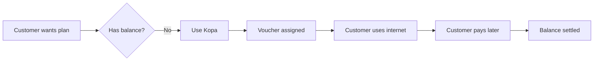

## Overview

Kopa is NasRadius's built-in Buy Now Pay Later (BNPL) feature. It allows customers to access internet plans immediately and pay later.

## How Kopa Works

## Key Features

<CardGroup cols={2}>
  <Card title="Analytics" icon="chart-line" href="/kopa/analytics">
    Track Kopa performance and metrics
  </Card>
  <Card title="Management" icon="gear" href="/kopa/management">
    Manage Kopa customers and balances
  </Card>
  <Card title="Plan Management" icon="list" href="/kopa/plan-management">
    Configure Kopa-enabled plans
  </Card>
  <Card title="Reports" icon="file-chart-column" href="/kopa/reports">
    View detailed Kopa reports
  </Card>
</CardGroup>

## Kopa Metrics

The Kopa dashboard shows:

| Metric | Description |
|--------|-------------|
| Total Kopa Customers | Users with active Kopa |
| Total Kopa Revenue | Revenue from Kopa purchases |
| Plans Sold | Number of Kopa-purchased plans |
| Outstanding Balance | Total amount owed |

## Benefits

<AccordionGroup>
  <Accordion icon="users" title="For Customers">
    Get internet access even without immediate funds
  </Accordion>
  <Accordion icon="building" title="For ISPs">
    Increase sales and customer loyalty
  </Accordion>
</AccordionGroup>

## Accessing Kopa

Click **Kopa** in the sidebar navigation. The Kopa section includes multiple tabs:
- Analytics
- Management
- Plan Management
- Reports

