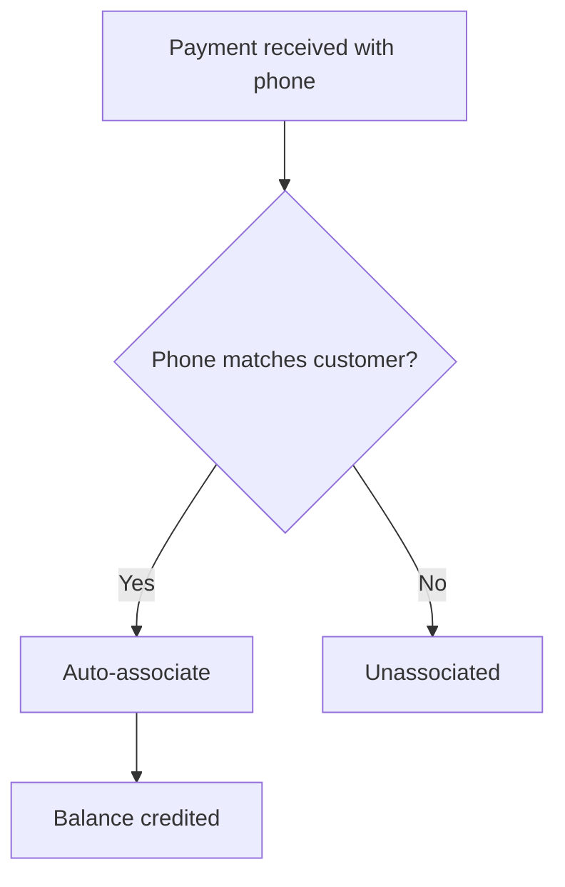

## Overview

Associated payments are transactions that have been successfully linked to customer accounts. When a payment is associated:
- Customer's balance is credited
- Customer can purchase internet plans
- Revenue is properly attributed

## Viewing Associated Payments

1. Navigate to **Payments** in the sidebar
2. The default view shows associated payments
3. If viewing unassociated, click **Regular** button to switch back

## Payment List

The associated payments table shows:

| Column | Description |
|--------|-------------|
| # | Row number |
| Customer | Account number |
| Code | Transaction code |
| Phone | Payer's phone |
| Amount | Payment amount |
| Date Paid | Transaction timestamp |
| Action | Disassociate button |

<Frame>
  
</Frame>

## Making a Manual Payment

To record a payment manually:

<Steps>
  <Step title="Click Make Payment">
    Click the **Make Payment** button at the top
  </Step>
  <Step title="Select Customer">
    Choose the customer from the dropdown
  </Step>
  <Step title="Enter Amount">
    Input the payment amount
  </Step>
  <Step title="Confirm">
    Click **Submit** to record the payment
  </Step>
</Steps>

<Note>
  Manual payments are immediately associated with the selected customer.
</Note>

## Disassociating a Payment

If a payment was associated with the wrong customer:

<Steps>
  <Step title="Find the Payment">
    Locate the payment in the list
  </Step>
  <Step title="Click Disassociate">
    Click the red **Disassociate** button
  </Step>
  <Step title="Confirm">
    Click **Confirm** in the dialog
  </Step>
</Steps>

<Warning>
  Disassociating removes the payment from the customer's balance. The payment moves to unassociated payments.
</Warning>

## Understanding Payment Codes

Payment codes are unique identifiers:

```
Format: ABCD1234XYZ
Source: Generated by payment provider (M-PESA, etc.)
Purpose: Reference for support and reconciliation
```

## Phone Number Matching

Payments are auto-associated based on phone numbers:



## Searching Payments

Search functionality:
- **Local search first**: Checks currently loaded payments
- **Backend search**: Queries server for older records
- **Debounced**: Waits 300ms after typing

Search fields:
- Customer Account Number
- Phone Number
- Transaction Code
- Amount

## Balance Impact

When payment is associated:

```
New Balance = Previous Balance + Payment Amount
```

| Action | Balance Effect |
|--------|----------------|
| Payment associated | Balance increases |
| Payment disassociated | Balance decreases |
| Voucher purchased | Balance decreases |

## Best Practices

<AccordionGroup>
  <Accordion icon="check-double" title="Verify Associations">
    Periodically review that payments match the correct customers
  </Accordion>
  <Accordion icon="clock" title="Prompt Recording">
    Record manual payments immediately to avoid discrepancies
  </Accordion>
  <Accordion icon="file-lines" title="Keep References">
    Note the transaction code when handling customer queries
  </Accordion>
</AccordionGroup>

## Troubleshooting

| Issue | Cause | Solution |
|-------|-------|----------|
| Payment shows wrong customer | Phone number used by multiple accounts | Verify customer identity |
| Balance not updated | Page not refreshed | Refresh the page |
| Can't find payment | Too old, not loaded | Use search function |

## Integration with Other Features

| Feature | Relationship |
|---------|--------------|
| Customer Balance | Payments credit the balance |
| Vouchers | Purchased using credited balance |
| Dashboard Revenue | Aggregates associated payments |
| Transactions | Complete log includes all payments |

## Next Steps

<CardGroup cols={2}>
  <Card
    title="Unassociated Payments"
    icon="link-slash"
    href="/payments/unassociated-payments"
  >
    Handle orphaned payments
  </Card>
  <Card
    title="Transactions"
    icon="receipt"
    href="/payments/transactions"
  >
    View complete payment history
  </Card>
</CardGroup>

