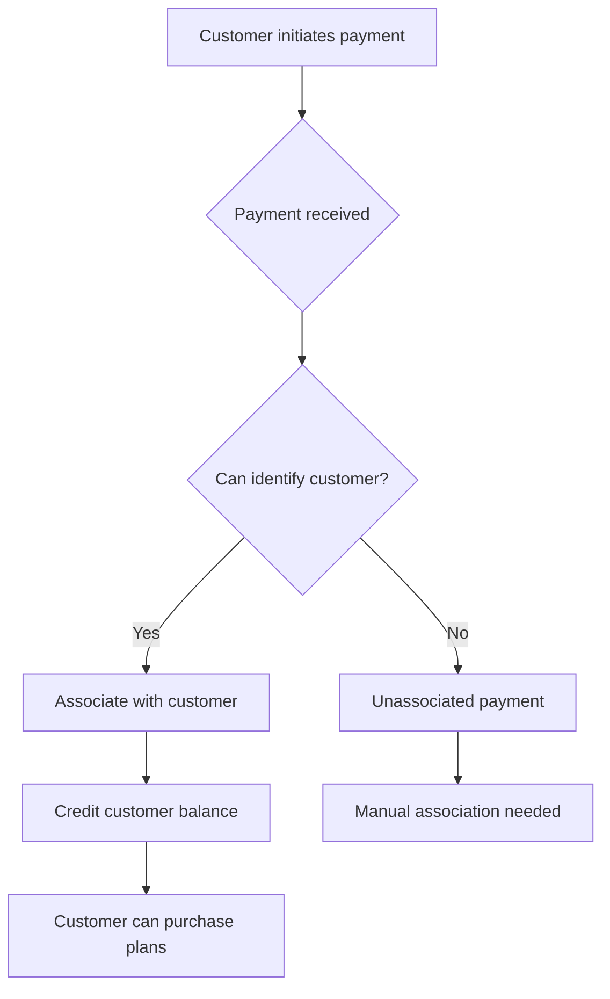

## Overview

NasRadius provides comprehensive payment management including:
- **Associated Payments**: Payments linked to customer accounts
- **Unassociated Payments**: Orphaned payments needing customer assignment
- **Transactions**: Complete transaction history

## Payment Flow

## Payment Types

<CardGroup cols={3}>
  <Card title="Associated" icon="link" href="/payments/associated-payments">
    Linked to a customer account, balance credited
  </Card>
  <Card title="Unassociated" icon="link-slash" href="/payments/unassociated-payments">
    Received but not linked to any customer
  </Card>
  <Card title="Transactions" icon="receipt" href="/payments/transactions">
    Complete payment history log
  </Card>
</CardGroup>

## Payment Sources

NasRadius can receive payments from:

| Source | Description | Auto-Associate |
|--------|-------------|----------------|
| M-PESA STK Push | Customer pays via STK prompt | ✅ Yes |
| Kopokopo | Payment aggregator | ✅ Yes |
| Manual Entry | Admin records payment | Manual |
| Till Payment | Customer pays to Till directly | Sometimes |

## Associated vs Unassociated

| Aspect | Associated | Unassociated |
|--------|------------|--------------|
| Customer linked | ✅ Yes | ❌ No |
| Balance credited | ✅ Yes | ❌ No |
| Can purchase plans | ✅ Yes | ❌ No |
| Action needed | None | Manual association |

## Quick Actions

From the Payments page, you can:

<AccordionGroup>
  <Accordion icon="plus" title="Make Payment">
    Manually record a payment for a customer
  </Accordion>
  <Accordion icon="eye" title="View Unassociated">
    Toggle between associated and unassociated payments
  </Accordion>
  <Accordion icon="link" title="Associate Payment">
    Link an unassociated payment to a customer
  </Accordion>
  <Accordion icon="link-slash" title="Disassociate Payment">
    Remove the link between payment and customer
  </Accordion>
</AccordionGroup>

## Payment Data

Each payment record contains:

| Field | Description |
|-------|-------------|
| Customer | Account number (if associated) |
| Code | Unique transaction code |
| Phone | Payer's phone number |
| Amount | Payment amount |
| Date Paid | Transaction timestamp |

## Searching Payments

Use the search bar to find payments by:
- Customer Account Number
- Phone Number
- Transaction Code
- Amount

<Tip>
  Search is optimized - it first searches locally, then queries the server for older records.
</Tip>

## Payment Reports

Payment data feeds into:

| Report | Location | Data Shown |
|--------|----------|------------|
| Daily Revenue | Dashboard | Today's payments sum |
| Weekly Revenue | Dashboard | This week's payments |
| Monthly Revenue | Dashboard chart | Monthly breakdown |
| Total Revenue | Dashboard | All-time total |

## Best Practices

<AccordionGroup>
  <Accordion icon="clock" title="Regular Reconciliation">
    Check unassociated payments daily to ensure no customer is missed
  </Accordion>
  <Accordion icon="check" title="Verify Associations">
    Confirm payments are linked to correct customers
  </Accordion>
  <Accordion icon="file-invoice" title="Keep Records">
    Maintain transaction records for accounting
  </Accordion>
</AccordionGroup>

## Troubleshooting

| Issue | Possible Cause | Solution |
|-------|----------------|----------|
| Payment not showing | Callback delay | Wait and refresh |
| Wrong customer linked | Phone number mismatch | Disassociate and reassociate |
| Balance not updated | Association pending | Complete association |

## Next Steps

<CardGroup cols={2}>
  <Card
    title="Associated Payments"
    icon="link"
    href="/payments/associated-payments"
  >
    Manage linked payments
  </Card>
  <Card
    title="Unassociated Payments"
    icon="link-slash"
    href="/payments/unassociated-payments"
  >
    Link orphaned payments
  </Card>
</CardGroup>

