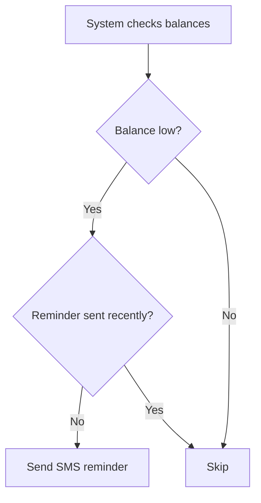

## Overview

Balance Reminders automatically notify customers when their account balance is low.

## Configuration

| Setting | Description |
|---------|-------------|
| Reminder Interval | Days between reminder SMS |

## Setting the Interval

<Steps>
  <Step title="Click Edit Interval">
    Click the **Edit Interval** button
  </Step>
  <Step title="Enter Days">
    Type the number of days between reminders
  </Step>
  <Step title="Save">
    Click **Save Interval**
  </Step>
</Steps>

## How It Works

## Recommended Intervals

| Scenario | Interval |
|----------|----------|
| Frequent top-ups | 3-5 days |
| Weekly top-ups | 7 days |
| Monthly | 14-30 days |

## Best Practices

- Don't set too short (avoid spam)
- Match customer usage patterns
- Combine with expiry notifications
- Include top-up instructions in SMS

