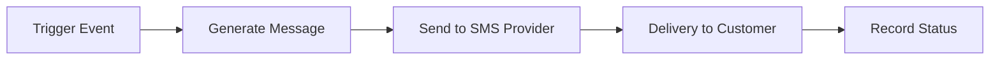

## Overview

NasRadius includes an SMS notification system to keep customers informed about:
- Payment confirmations
- Voucher assignments
- Low balance reminders
- Expiry notifications

## Key Features

<CardGroup cols={2}>
  <Card title="Send Notifications" icon="paper-plane" href="/notifications/sending-notifications">
    Send SMS messages to individual customers
  </Card>
  <Card title="Notification History" icon="clock-rotate-left" href="/notifications/notification-history">
    View all sent notifications and their status
  </Card>
</CardGroup>

## SMS Providers

NasRadius supports multiple SMS providers:

| Provider | Description |
|----------|-------------|
| AfricasTalking | Popular African SMS gateway |
| CelcomAfrica | East African SMS provider |
| MobiTech | SMS provider with sender name support |

<Note>
  Configure your SMS provider in **Settings** → **SMS Settings** before sending notifications.
</Note>

## Notification Types

| Type | Trigger | Description |
|------|---------|-------------|
| Payment | Payment received | Confirms payment received |
| Voucher | Voucher assigned | Notifies plan activation |
| Balance | Low balance | Reminder to top up |
| Expiry | Voucher expiring | Warns of upcoming expiry |

## Notification Flow

## Best Practices

- Keep messages concise (SMS character limits)
- Include relevant details (amount, plan, expiry)
- Configure balance reminders appropriately
- Monitor delivery status for failures

